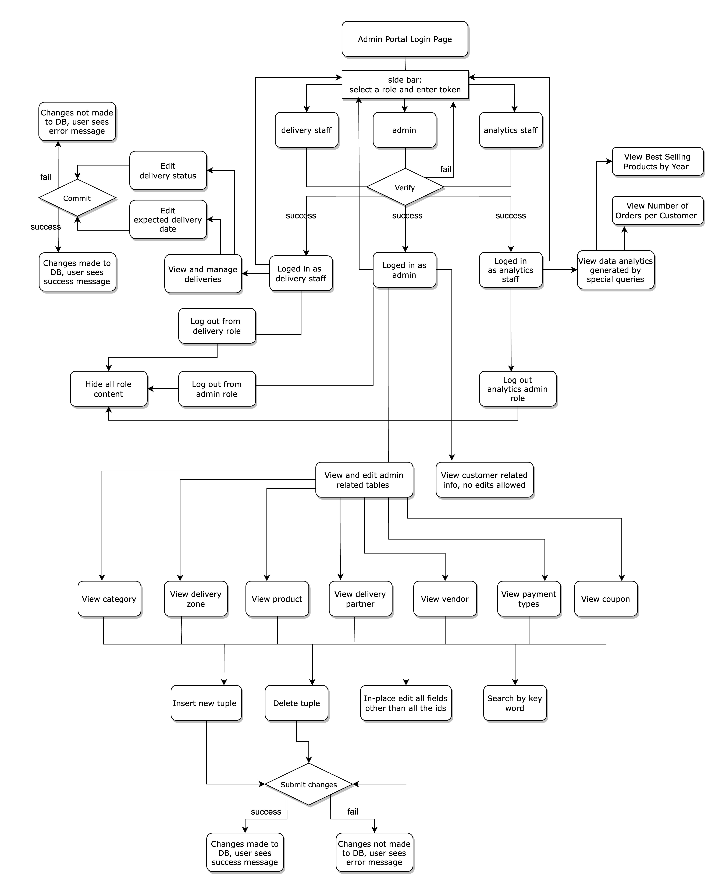
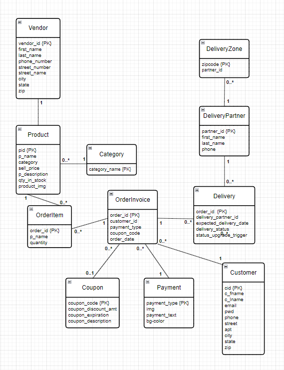
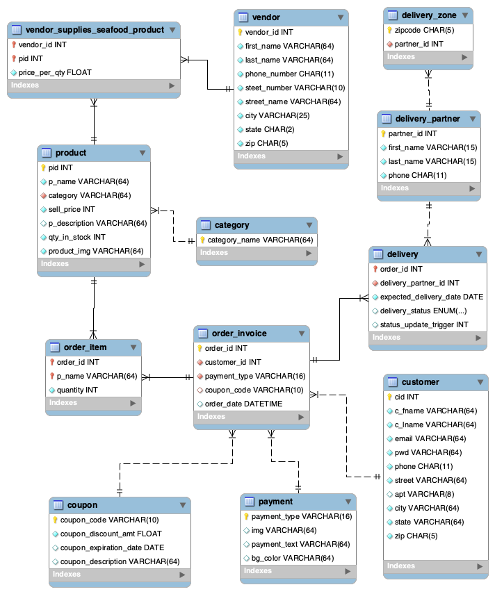

## End Results

First thing first, check out the end results!  
[Seafood Trading Co. - Admin Portal]  
Note: if the app crashes after a few visits, click "`Rerun`" from the three dots at the top right corner

[Seafood Trading Co. - Customer Site]

## Inspiration

This project is a database application for managing seafood orders and business operation through three components: a costomer site, a user-friendly admin portal, and a well designed MySQL schema. The inspiration comes from ["I.S.F.Trading.Co,Inc."], a seafood processing & trading company in Portland, Maine. Currently, orders are placed by viewing [this menu](https://okk.mazhizuo.com/?url=MjAyMjEyMjUwMjE0WOP42) and texting the order to the staff. This manual process can be tedious, error-prone, and inefficient. Our goal was to streamline the ordering process for both users and the business's administration.

## Application

To address this challenge, we developed a new website for users to place orders and a robust admin dashboard to manage these orders. The user interface is built with React and NextJS, hosted on Vercel, ensuring a seamless and visually appealing experience. The admin portal is developed in Python using [Streamlit], hosted on [Streamlit Community Cloud], supporting CRUD operations and data analytics capabilities. Both components are interconnected through a MySQL database hosted on a DigitalOcean VPC.

**Built With**


<br>

**About this Repo**

This repo contains code for the admin portal component only, and a self-contained dump file of the underlying MySQL database schema for recreating the db structure and stored procedures used. The complete project is published at this repo: [DBMS Final Project].

## Re-creating and Running the Admin Portal on Your Machine

### Prerequisites

Before you begin, ensure you have the following installed:

- [Python] (3.8 - 3.12), PIP
- [MySQL Workbench]

### Setup

1.  Clone this repo, cd into the repo directory.

2.  Install Python dependencies (pysql, pandas, and streamlit) through terminal:

    ```bash
    pip install -r requirements.txt
    ```

3.  Have your MySQL server up and running. (Guide: [Connecting to the MySQL server with the mysql Client])

4.  With MySQL Workbench, go to 'Server' -> 'Data Import' -> 'Import from Self-Contained File' -> select the "[./database/dump.sql]" file obtained from this repo.

5.  In the repo directory, make a hidden directory "`.streamlit`" and make a "`secrets.toml`" file under it; make sure no "`.txt`" extension goes after the file name. Write the following to the file with your local credentials:

         DB_HOST="localhost"
         DB_PORT=3306
         DB_USER="root"
         DB_PASSWORD="your_password"
         DB_NAME="seafood_service_v4"

         admin="adminpwd"
         analytics="analyticspwd"
         delivery="deliverypwd"
         devops="devopspwd"

### Running the Application

1. In your terminal, go into the repo directory, run "`streamlit run isf_dbapp.py`".
2. A webpage should pop up in your browser; if not, navigate to "http://localhost:8501" in your browser.
3. To stop running the app, from the same terminal, hit "`Control` + `C`".
4. The above setup should connect the streamlit web app to the local database you recreated with the dump file provided, instead of our remote hosted database.

### Using the Application

To navigate through the admin portal and manage the database, first select a role and log in with the its password.
If successfully verified, you can then access the corresponding content. To give an overview of the functionality for each role:

- Admin staff: Can view all tables, can insert/delete/update from most tables. The view-only tables are tables with customer-related information, and those can be modified through the customer site front end.
- Analytics staff: Marketing staff, accounting staff, etc. Can view data analysis & visualization generated by special queries, cannot edit.
- Delivery staff: Can view the "delivery" table, can edit "expected_delivery_date" and "delivery_status".

A complete view of user activities:


## The Underlying MySQL Database Schema

### Conceptual Design (UML Diagram):



### Logical Design (Reverse Engineer)



### Future Work

1. The planned use of this database is to act as a storefront for a local seafood shop in Boston. The idea is for users to visit this website to shop for their seafood. We hope that this database continues to grow and that we can integrate it into a local shop in Boston.
2. In the future, we might expand beyond just seafood, adding different grocery types. We hope to add more procedures for many more operations as new use-cases arise.

<!-- auto references -->

[Seafood Trading Co. - Admin Portal]: https://seafoodtradingco.streamlit.app
[Seafood Trading Co. - Customer Site]: https://seafood-delivery.vercel.app
["I.S.F.Trading.Co,Inc."]: http://www.seaurchinmaine.com
[Streamlit Community Cloud]: https://streamlit.io/cloud
[MySQL Workbench]: https://dev.mysql.com/doc/mysql-installation-excerpt/5.7/en/
[Connecting to the MySQL server with the mysql Client]: https://dev.mysql.com/doc/mysql-getting-started/en/#mysql-getting-started-connecting
[Python]: https://www.python.org/downloads/
[DBMS Final Project]: https://github.com/neelthepatel8/dbms-final-project
[isf_config.py]: isf_config.py
[isf_dbapp.py]: isf_dbapp.py
[./database/dump.sql]: ./database/dump.sql
